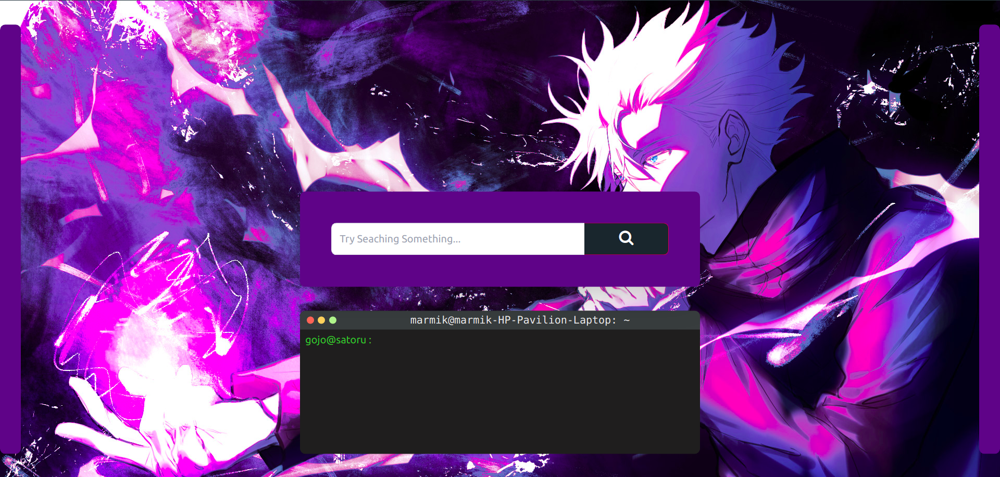
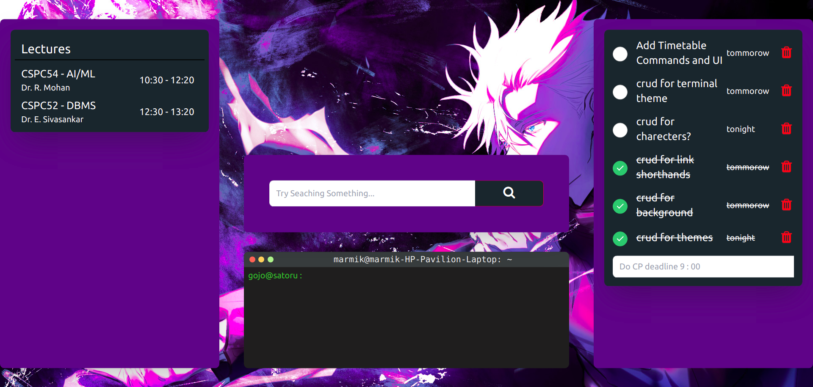
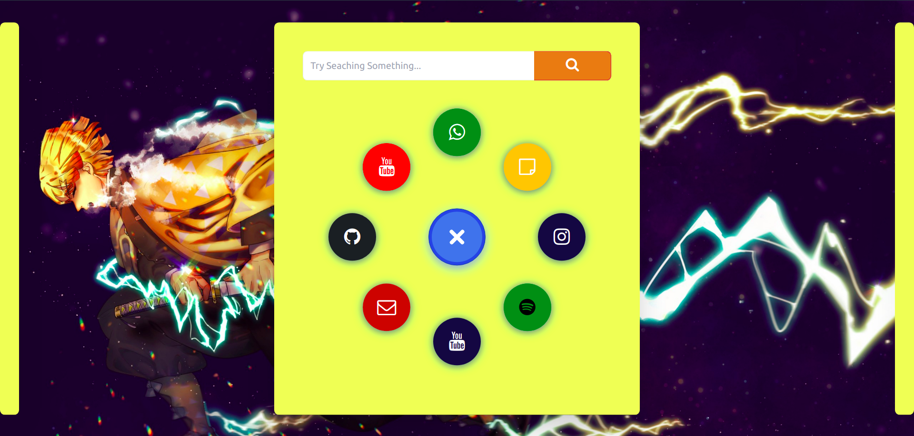

# Custom Newtab

Just a newtab with some extra stuff.

## Pictures

## Things

### 1. Timetable

Has a timetable of the particular day on the leftside. 
Can be toggled using command or left arrow key or `a` key.

### 2. Todo

A simple todo area on the right. 
Can be toggled using command or right arrow key or `d` key.

### 3. Fav sites and search

Simple search for google, and can open the fav sites
using `s` or down arrow and close using `w` or up arrow.

### 4. Terminal ( the good stuff ;) )

Provide some commands for freq used things and appearance.
Currently available commands.

#### open [some shorthand]
used to open that particular shorthand in the same tab
example : `open yt` - opens youtube 

#### sh [keyword] [params]
availavle  are 
- list : lists all available shorthands
- set : takes 2 params `shorthand` and `url` to set one
- del : deletes shorthand by name

#### search

Does what you think it does, searchs whatever is followed after the search keyword.

#### toggle [params]

toggles the sidepanels, based on l for left, r for right and a for all(both).

#### clear 

clears the terminal

#### bg [keyword] [params]

available keywords
- set : pass a saved bg name or a url to set bg
- save : pass name and url to save a bg
- del : pass name to delete the bg
- list : lists all saved bgs

#### theme [keyword] [params]

available keywords
- set : pass a saved theme name to apply it
- save : pass a name to save the current theme with that name 
- del : pass name to delete a theme
- list : lists all saved themes

#### style [property] [value]

used to make changes to the current theme
sets the value of the given property

available properties

- pc : primary-color
- ac1 : accent-color-1
- ac2 : accent-color-2
- fc1 : font-color-1
- fc2 : font-color-2
- tc : todo-color
- ttc : tt-color